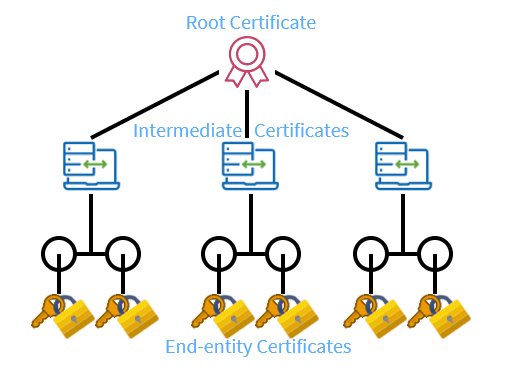

# Part 1: Create a Certificate Chain of Trust

The SSL/TLS internet security standard is based on a trust relationship model, also called
“certificate chain of trust.”

The following exercise uses the [openssl](https://www.openssl.org/) command line tool. OpenSSL is
probably the most known cryptographic library and is used by many applications.

The goal is to generate a Certificate Chain of Trust.

1. Create a Root Certificate Authority (Root CA) and self-sign its certificate.
2. Create an Intermediate CA and sign its Certificate by the Root CA.



---
<!--toc:start-->
- [Setup](#setup)
- [Root certificate: The Trust Anchor](#root-certificate-the-trust-anchor)
  - [1. Create a Root Certificate Authority](#1-create-a-root-certificate-authority)
    - [1.1 Prepare the directory](#11-prepare-the-directory)
    - [1.2 Setup the root CA's directory structure](#12-setup-the-root-cas-directory-structure)
    - [1.3 Create a root CA configuration file](#13-create-a-root-ca-configuration-file)
  - [2. Create a Root Certificate](#2-create-a-root-certificate)
    - [1.1 Generate a private key](#11-generate-a-private-key)
    - [1.2 Generate and Self-Sign the Root Certificate](#12-generate-and-self-sign-the-root-certificate)
    - [1.3 Check out the root certificate](#13-check-out-the-root-certificate)
  - [3. Generate a Certificate Revocation List (CRL)](#3-generate-a-certificate-revocation-list-crl)
  - [4. Generate an OCSP Responder Certificate Signing Request (CSR)](#4-generate-an-ocsp-responder-certificate-signing-request-csr)
- [Intermediate certificate: The Issuing CA](#intermediate-certificate-the-issuing-ca)
  - [1. Create an Intermediate Certificate Authority](#1-create-an-intermediate-certificate-authority)
  - [2. Create an Intermediate Certificate](#2-create-an-intermediate-certificate)
  - [3. Use the Root CA to sign the Intermediate Certificate](#3-use-the-root-ca-to-sign-the-intermediate-certificate)
- [Server Certificate: The End-Entity](#server-certificate-the-end-entity)
  - [1 Specify some certificate parameters.](#1-specify-some-certificate-parameters)
  - [2. Generate a certificate signing request](#2-generate-a-certificate-signing-request)
  - [3. Submit the Certificate Signing Request to the Intermediate CA.](#3-submit-the-certificate-signing-request-to-the-intermediate-ca)
  - [4. Chain of Trust for Java Apps](#4-chain-of-trust-for-java-apps)
<!--toc:end-->
---

# Setup

1. Make sure that openssl is installed

   ```bash
   openssl version
   ```

2. Familiarize yourself with openssl

   ```bash
   # list all commands
   openssl help

   # get options for a specific command like 'ca'
   openssl help ca
   ```

# Root certificate: The Trust Anchor

A root certificate is a self-signed certificate that follows the standards of the X.509 certificate.
It is generally the certificate in which you need to place your trust, as there is no other entity
which certifies that this root is trustworthy. Root certificates are typically distributed with your
operating system and your browser to ensure a common set of trust can be established.

## 1. Create a Root Certificate Authority

### 1.1 Prepare the directory

Create a directory to store all keys and certificates for the Root Authority.

```bash
cd host
ca_name="MyCAs"
dir="$(pwd)/$ca_name"
mkdir -p "$dir"
cd "$dir"
mkdir root
cd root
```

### 1.2 Setup the root CA's directory structure

- `index.txt` and `serial` files act as a flat file database to keep track of signed certificates.
- `crlnumber` is used to keep track of certificate revocation lists.

```bash
mkdir private certs crl csr
touch index.txt
touch index.txt.attr
# In practice you might want to generate a random serial using `openssl ca -create_serial ...` to
# ensure proper randomness in the serial. For ease of use we will use a fixed starting point. This
# has the issue that all certificates that will be generated from us using this as a starting point
# will have the same serial, meaning the same "signature". This is not ideal in productive
# scenarios.
echo 1000 > serial
echo 1000 > crlnumber
```

### 1.3 Create a root CA configuration file

A Certificate Authority (CA) configuration file in OpenSSL is crucial because it defines the
parameters and rules that guide how the CA operates, manages certificates, and ensures consistency
across issued certificates. I.e. to only sign certificate from servers in Zurich, Switzerland with a
TTL of max one year. If it is not specified, OpenSSL will take the default settings.

Note the long values for default days (10000 -> 27 years) as we don't care about renewing the root
certificate anytime soon. This is also done in real life - You generate a private key somewhere in a
bunker deep underground, rip out the network card and put glue in the ethernet port.

Before you create the config file, try to understand what is specified in it. I.e., you can specify
contact details to reach the Root CAs customer support, or policies specifying what the intermediate
CAs will be allowed to sign.

```bash
cat << EOF > openssl_root.ini
[ ca ]
# Name of the CA to use by default, will be defined below.
default_ca = CA_default

####################################################################
## The definition of our CA.
[ CA_default ]
# Directory and file locations.
dir               = $dir/root
certs             = \$dir/certs
crl_dir           = \$dir/crl
new_certs_dir     = \$dir/certs
database          = \$dir/index.txt
serial            = \$dir/serial
RANDFILE          = \$dir/private/.rand

# The root key and root certificate.
private_key       = \$dir/private/ca.key.pem
certificate       = \$dir/certs/ca.crt.pem

# For certificate revocation lists.
crlnumber         = \$dir/crlnumber
crl               = \$dir/crl/ca.crl.pem
crl_extensions    = crl_ext
default_crl_days  = 10000

default_md        = sha384

name_opt          = ca_default
cert_opt          = ca_default
default_days      = 10000
preserve          = no
policy            = policy_strict

####################################################################
## Some policies on what to enforce when people request the
## certificates.
[ policy_strict ]
# Allow the intermediate CA to sign a more diverse range of certificates.
countryName             = match
stateOrProvinceName     = match
localityName            = supplied
organizationName        = match
organizationalUnitName  = optional
commonName              = supplied
emailAddress            = optional

####################################################################
## We define general certificate configurations when requests are
## made to the CA.
[ req ]
default_bits        = 2048
distinguished_name  = req_distinguished_name
string_mask         = utf8only
default_md          = sha256
x509_extensions     = v3_ca

####################################################################
## We define the DN (distinguished name) section of the certificates
## we want to sign.
[ req_distinguished_name ]
countryName                 = Country Name (2 letter code)
countryName_default         = CH
countryName_min             = 2
countryName_max             = 2
stateOrProvinceName         = State or Province Name
stateOrProvinceName_default = Zurich
localityName                = Locality Name
localityName_default        = Zurich
0.organizationName          = Organization Name
organizationalUnitName      = Organizational Unit Name
commonName                  = Common Name
commonName_max              = 64
emailAddress                = Email Address
emailAddress_max            = 64


####################################################################
## We define extensions for various requests we will make.
[ v3_ca ]
subjectKeyIdentifier   = hash
authorityKeyIdentifier = keyid:always,issuer
basicConstraints       = critical, CA:true
keyUsage               = critical, digitalSignature, cRLSign, keyCertSign

[ v3_intermediate_ca ]
subjectKeyIdentifier   = hash
authorityKeyIdentifier = keyid:always,issuer
basicConstraints       = critical, CA:true, pathlen:0
keyUsage               = critical, digitalSignature, cRLSign, keyCertSign
crlDistributionPoints  = @crl_info
authorityInfoAccess    = @ocsp_info

####################################################################
## We define OCSP (online certificate status protocol) and CRL
## (certificate revocation list) options.
[ ocsp ]
basicConstraints       = CA:false
subjectKeyIdentifier   = hash
authorityKeyIdentifier = keyid,issuer
keyUsage               = critical, digitalSignature, keyEncipherment
extendedKeyUsage       = critical, OCSPSigning

[ crl_ext ]
authorityKeyIdentifier = keyid:always

[ crl_info ]
URI.0 = http://$ca_name/root/crl

[ ocsp_info ]
caIssuers;URI.0 = http://$ca_name/root/certificate
OCSP;URI.0      = http://$ca_name/root/ocsp

EOF
```

## 2. Create a Root Certificate

### 1.1 Generate a private key

Generate a private key and store it savely in `private/ca.key.pem` encrypted with the password
'RootPassword'. OpenSSL can generate a new private key using various cryptographic algorithms, such
as RSA or ECC (Elliptic Curve Cryptography).

```bash
echo
echo "Generate Root CA certificate"
echo

# NIST/SECG curve over a 384 bit prime field (can check using `openssl ecparam -list_curves`)
# For interoperability, always choose either "prime256v1" or "secp384r1". Clients must support the
# curve to validate signatures.
curve="secp384r1"

openssl ecparam -genkey -name $curve | openssl ec -aes256 -out private/ca.key.pem -passout pass:RootPassword
chmod 400 private/ca.key.pem
```

To read the encrypted private key, run

```bash
cat private/ca.key.pem
```

To see the actual key pair, decrypt and open it with

```bash
openssl ec -in private/ca.key.pem -text -noout -passin pass:RootPassword
```

Why is there a public key included? EC Private Keys Always Contain the Public Key. When you generate
an EC private key, it doesn’t just store the secret part. It derives the public key from the private
key using elliptic curve cryptography. The public key is mathematically linked to the private key,
so OpenSSL includes it in the key structure. Something like that...

### 1.2 Generate and Self-Sign the Root Certificate

Creates and processes certificate requests (CSRs) in PKCS#10 format. It can additionally create
self-signed certificates for use as root CAs for example.

```bash
openssl req -config openssl_root.ini -new -x509 -sha384 -extensions v3_ca \
  -key private/ca.key.pem -passin pass:RootPassword -out certs/ca.crt.pem \
  -subj "/CN=$ca_name Root CA/C=CH/ST=Zurich/L=Zurich/O=IPT Trust Services AG" \
  -days 10000
```

- `openssl req -x509` generates a certificate request, but with `-x509`, it directly creates a
  self-signed certificate.
- `-sha384` is the hashing algorithm used for the certificate signature.
- `key` provides the private key for signing a new certificate or certificate request. This results
  in a new self-signature.
- `certs/ca.crt.pem` This will be the Root CA's self-signed certificate.

### 1.3 Check out the root certificate

Verify the Root CA certificate. Does what you see make sense?

```bash
openssl x509 -in certs/ca.crt.pem -text -noout
```

Clicking on the file on your mac will ask you to add it to your trusted Roots. If you inspect the
Certificate, you will see that ios will tell you that the Root is not trusted. All browsers and
operating systems have a list of Roots build in that they trust.

## 3. Generate a Certificate Revocation List (CRL)

This command creates an updated CRL file (`ca.crl.pem`), which can be distributed to clients to
ensure they do not trust revoked certificates.

```bash
openssl ca -config openssl_root.ini \
  -gencrl -out crl/ca.crl.pem \
  -passin pass:RootPassword
```

- The `-passin` is needed because the password protected private key is needed to sign the CRL.

## 4. Generate an OCSP Responder Certificate Signing Request (CSR)

OCSP stands for Online Certificate Status Protocol. This OCSP responder certificate allows an OCSP
server to check certificate revocation status for certificates issued by the Root CA. Sign OCSP
responses, proving their authenticity.

```bash
openssl req \
  -new \
  -newkey ec:<(openssl ecparam -name $curve) \
  -keyout private/ocsp-root.key.pem \
  -passout pass:RootPassword \
  -out csr/ocsp-root.csr.pem \
  -subj "/CN=$ca_name OCSP for root/C=CH/ST=Zurich/L=Zurich/O=IPT Trust Services AG/"
openssl ca -batch \
  -config openssl_root.ini \
  -extensions ocsp \
  -days 10000 \
  -notext \
  -md sha384 \
  -in csr/ocsp-root.csr.pem \
  -out certs/ocsp-root.crt.pem \
  -passin pass:RootPassword
```

# Intermediate certificate: The Issuing CA

At least one intermediate certificate will almost always be present in an SSL certificate chain.
They provide a vital link to enable the Root CA to extend its trustworthy reputation to otherwise
untrustworthy end-entities.

## 1. Create an Intermediate Certificate Authority

Create the CA directory and its configuration file, similar to the Root CA.

```bash
cd $dir
mkdir intermediate
cd intermediate
mkdir certs crl csr private
touch index.txt
touch index.txt.attr
echo 2000 > serial
echo 2000 > crlnumber

cat << EOF > openssl_intermediate.ini
[ ca ]
default_ca = CA_default

[ CA_default ]
dir               = $dir/intermediate
certs             = \$dir/certs
crl_dir           = \$dir/crl
new_certs_dir     = \$dir/certs
database          = \$dir/index.txt
serial            = \$dir/serial
RANDFILE          = \$dir/private/.rand

private_key       = \$dir/private/int.key.pem
certificate       = \$dir/certs/int.crt.pem

unique_subject    = no # Allow creation of several certs with the same subject.
copy_extensions   = copy

# For certificate revocation lists.
crlnumber         = \$dir/crlnumber
crl               = \$dir/crl/int.crl.pem
crl_extensions    = crl_ext
default_crl_days  = 1800

default_md        = sha384

name_opt          = ca_default
cert_opt          = ca_default
default_days      = 3000
preserve          = no
policy            = policy_loose

[ policy_loose ]
# Allow the intermediate CA to sign a more diverse range of certificates. Can be checked by root.
countryName             = optional
stateOrProvinceName     = optional
localityName            = optional
organizationName        = optional
organizationalUnitName  = optional
commonName              = supplied
emailAddress            = optional

[ req ]
default_bits        = 2048
distinguished_name  = req_distinguished_name
string_mask         = utf8only
default_md          = sha256

[ req_distinguished_name ]
countryName                 = Country Name (2 letter code)
countryName_default         = CH
countryName_min             = 2
countryName_max             = 2
stateOrProvinceName         = State or Province Name
stateOrProvinceName_default = Zurich
localityName                = Locality Name
localityName_default        = Zurich
0.organizationName          = Organization Name
organizationalUnitName      = Organizational Unit Name
commonName                  = Common Name
commonName_max              = 64
emailAddress                = Email Address
emailAddress_max            = 64

[ crl_ext ]
authorityKeyIdentifier=keyid:always

[ ocsp ]
basicConstraints       = CA:FALSE
subjectKeyIdentifier   = hash
authorityKeyIdentifier = keyid,issuer
keyUsage               = critical, digitalSignature, keyEncipherment
extendedKeyUsage       = critical, OCSPSigning

[ crl_info ]
URI.0 = http://$ca_name/intermediate/crl

[ ocsp_info ]
caIssuers;URI.0 = http://$ca_name/intermediate/certificate
OCSP;URI.0      = http://$ca_name/intermediate/ocsp

[ server_cert ]
basicConstraints       = CA:FALSE
subjectKeyIdentifier   = hash
authorityKeyIdentifier = keyid:always
keyUsage               = critical, digitalSignature, keyEncipherment
extendedKeyUsage       = serverAuth
crlDistributionPoints  = @crl_info
authorityInfoAccess    = @ocsp_info

EOF
```

The `server_cert` defines the certificate extensions we will use when signing server certificates
(leaf certificates).

## 2. Create an Intermediate Certificate

The private key of the Intermediate CA is password protected with password: `IntermediatePassword`.

```bash
openssl ecparam -name $curve -genkey | openssl ec -aes256 -out private/int.key.pem -passout pass:IntermediatePassword
```

```bash
openssl req -new \
  -key private/int.key.pem \
  -passin pass:IntermediatePassword \
  -out csr/int.csr \
  -subj "/CN=$ca_name Intermediate CA/C=CH/ST=Zurich/L=Zurich/O=IPT Trust Services AG"
```

Inspect the created certificate signing request (csr) that we will lates send to the Root CA to be
signed.

```bash
openssl req -in csr/int.csr -text -noout
```

## 3. Use the Root CA to sign the Intermediate Certificate

```bash
cd $dir
openssl ca -batch -config root/openssl_root.ini -extensions v3_intermediate_ca -days 10000 \
  -md sha384 -in intermediate/csr/int.csr -out intermediate/certs/int.crt.pem \
  -passin pass:RootPassword \
  -notext
```

In the `/root` folder, `index.txt` contains a new entry specifying the Intermediate CA we just
signed. The `index.txt` acts as a certificate database to track issued, revoked, or expired
certificates. Each line represents a certificate, with multiple columns containing its status and
metadata.

For our case, it should look something like:

```bash
V	20520707131612Z		1000	unknown	/C=CH/ST=Zurich/O=IPT Trust Services AG/CN=MyCAs Intermediate CA
```

- Column 1: Certificate Status. V means Valid.
- Column 2: Expiration Date
- Column 3: Revocation Date (empty here, but set if the certificate would have been revoked.)
- Column 4: Serial Number (1000). Unique serial number assigned to this certificate by the CA. We
  had set it to 1000 when creating the Root CA. It matches the serial number in the intermediate
  certificate signed by the Root CA.
- Column 5: Revocation Reason (unknown)
- Column 6: Distinguished Name (DN)

Checkout the Root-Signed intermediate certificate at `/intermediate/certs/int.crt.pem` using an
[online certificate decoder](https://certificatedecoder.dev/) or your terminal.

```bash
openssl x509 -noout -text -in intermediate/certs/int.crt.pem
```

The same certificate is also stored at `/root/certs/1000.pem`. The Root CA keeps a record of all its
signed certificates, with the respective serial number as filename.

- What is the issuer of the certificate?
- How long is it valid?
- Do other details make sense?

Finally, concatenate both certificates into a chain

```bash
cat intermediate/certs/int.crt.pem root/certs/ca.crt.pem > intermediate/certs/chain.crt.pem
```

You have now created a Root Authority and an Intermediate Authority, trusted (signed) by the Root.

The Intermediate CA can now go out into the world and offer us services to verify and sign our
End-Entity.

# Server Certificate: The End-Entity

Finally, we generate a server certificate for TLS. Switch to the directory in which the `MyCAs`
directory is, and create a new `/apps` directory where we will put the server certificate.

```bash
CURRENT_CA_PATH="$dir"
cd ..
appname=ubs-local
dir="$(pwd)/apps/$appname"
mkdir -p "$dir"
cd "$dir"
```

## 1 Specify some certificate parameters.

```bash
cat <<- EOF >> req.ini
[ req ]
distinguished_name = req_distinguished_name
req_extensions      = extensions

[ req_distinguished_name ]
commonName                     = Common Name
commonName_default             = $appname
countryName                    = Country Name (2 letter code)
countryName_default            = CH
countryName_min                = 2
countryName_max                = 2
stateOrProvinceName            = State or Province
stateOrProvinceName_default    = Zurich
localityName                   = Locality Name (eg, city)
localityName_default           = Zurich
organizationName               = Organization Name
organizationName_default       = UBS Mocked AG
organizationalUnitName         = Organizational Unit Name (eg, section)
organizationalUnitName_default = handson_deepdive

[ extensions ]
subjectAltName = @alt_names

[ alt_names ]
IP.1  = 127.0.0.1
DNS.0 = $appname
DNS.1 = "$appname.ch"
DNS.2 = "www.$appname.ch"
DNS.3 = "app.$appname.ch"
DNS.5 = localhost
#DNS.6 = Whatever else here
EOF
```

- `commonName`: The Common Name (CN) of the certificate, typically the domain name or hostname. It
  defaults to `$appname`, set earlier as 'ubs-local'.
- The certificate is extended with Subject Alternative Names (SAN). `[ alt_names ]` shows how
  multiple domain names can be added to one certificate. However, services like Let's Encrypt mostly
  limits alternatives to one domain name, like we do here.

## 2. Generate a certificate signing request

Let's generate a key pair:

```bash
openssl ecparam -name prime256v1 -genkey -noout -out $appname.key.pem
```

and create a CSR. It will ask you to specify some fields. Just press enter to use the defaults
specified before in the `req.ini` file.

```bash
openssl req -new \
  -key $appname.key.pem \
  -out $appname.csr.pem \
  -config req.ini
```

## 3. Submit the Certificate Signing Request to the Intermediate CA.

We sign the server certificate request using the intermediate CA, using its private key. The
`openssl_intermediate.ini` config file specifies the path to the private key. But we still need to
provide the passwort to the encrypted private key.

Make sure that the file paths work out...

```bash
openssl ca -batch \
  -config $CURRENT_CA_PATH/intermediate/openssl_intermediate.ini \
  -extensions server_cert \
  -days 730 \
  -notext \
  -md sha384 \
  -in $appname.csr.pem \
  -out $appname.crt.pem \
  -passin pass:IntermediatePassword
```

- The Certificate expires after 2 year. Down here in the chain of trust, things are more dynamic and
  less trustworthy, so you might want to renew certificates more frequently.

We can now build a full chain of trust, with root, intermediate and server certificate in one file.

```bash
cat "$appname.crt.pem" "$CURRENT_CA_PATH/intermediate/certs/chain.crt.pem" > "$appname.chain.crt.pem"
```

## 4. Chain of Trust for Java Apps

Java-based servers (like Tomcat) use Java Keystores (PKCS#12) to manage TLS/SSL certificates.

The .p12 file contains both the private key and the certificate chain, making it easy to import into
Java environments.

So lets repackage our server certificate, and password protect it with `password123`:

```bash
openssl pkcs12 -export \
  -inkey "$appname.key.pem" \
  -in "$appname.chain.crt.pem" \
  -out "$appname-keystore.p12" \
  -passout pass:password123
```

Inspect the content of the .p12 keystore. Can you see the 3 certificates?

```bash
keytool -list -v -keystore "$appname-keystore.p12" -storetype PKCS12 -storepass password123
```
